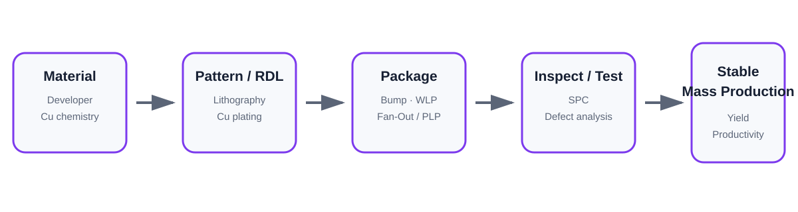

# NEPES Semiconductor Packaging Industry Field Study

## Overview

2026년 9월 18–19일 NEPES와 Hyundai Steel의 실제 제조 현장을 방문한 산업시찰 경험을, 반도체 공정·양산·품질 직무 관점에서 재구성한 프로젝트입니다.

포트폴리오의 중심은 **NEPES advanced packaging / process materials / manufacturing engineering**입니다.



## Main Insight

첨단 패키징의 양산 경쟁력은 package structure 하나에서 결정되지 않습니다.

```text
Material
  ↓
Pattern / Wet Process
  ↓
Cu RDL / Bump
  ↓
Package Integration
  ↓
Inspection / Test
  ↓
SPC / Defect Analysis
  ↓
Yield / Productivity
  ↓
Change Control
```

## NEPES Focus

- Bumping
- WLP
- FOWLP / PLP
- RDL
- Developer
- Cu electroplating
- equipment condition optimization
- SPC
- defect improvement
- quality change control

## Engineering Connection

참고한 NEPES process-engineering 공고에는 plating-solution management, defect improvement, SPC, yield improvement가 포함되고, equipment roles에는 setup, PM, condition optimization, yield/productivity improvement, and mass-production stabilization이 포함됩니다.

이 때문에 이번 방문은 재료공학 지식을 실제 생산기술 직무와 연결하는 계기가 되었습니다.

## Hyundai Steel

현대제철에서는 대규모 연속 제조에서 **material flow, equipment reliability, process control, logistics, safety**가 하나의 생산 시스템으로 묶이는 모습을 관찰했습니다.

See [Project Navigation](./guide/00_navigation.md) for the full field-study documentation.
